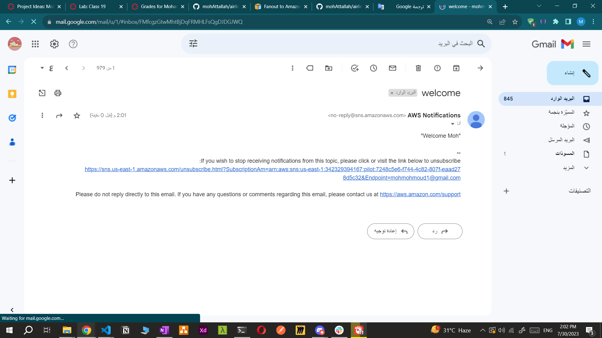
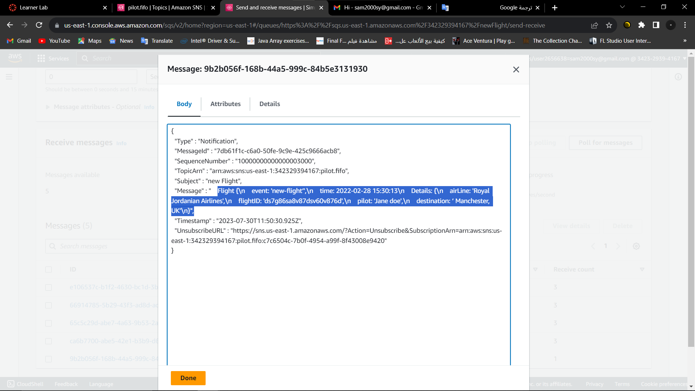

# Lab 19
## AWS: Events
Authors: Sham Al-Jalam, Mohammed Attallah
## URLs
*  pull request: 
### process:
we used Amazon SNS to create 2 topics then created an email protocol subscription for each of the 2 topics then we send emails to the emails adderessess we've provided:

then we tried to create a SQS queue as manager to send and receive messages with the topic pilot(SNS):

### UML

